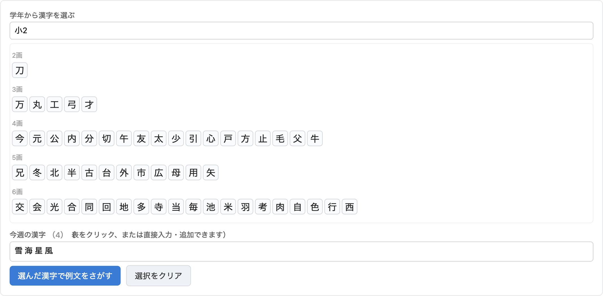
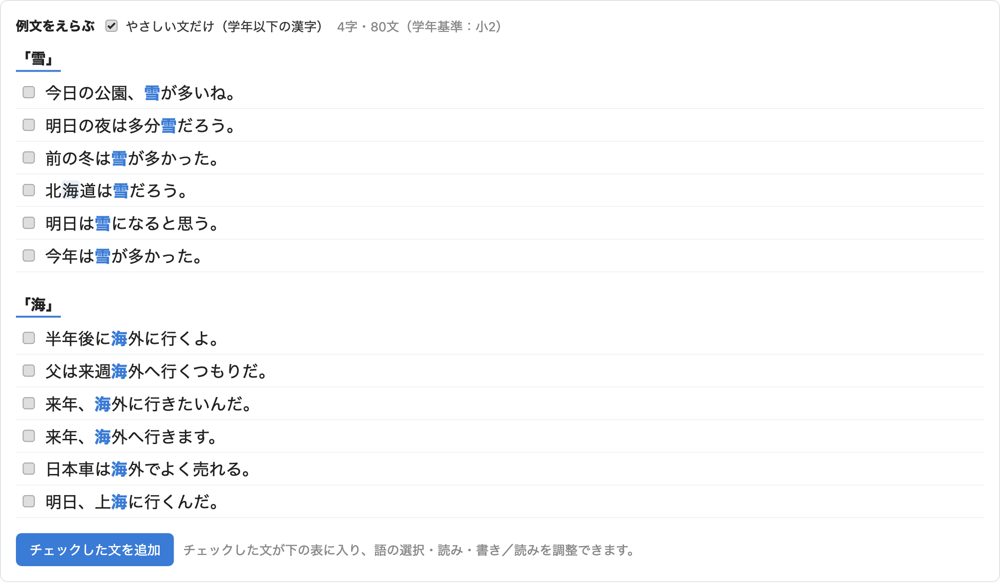
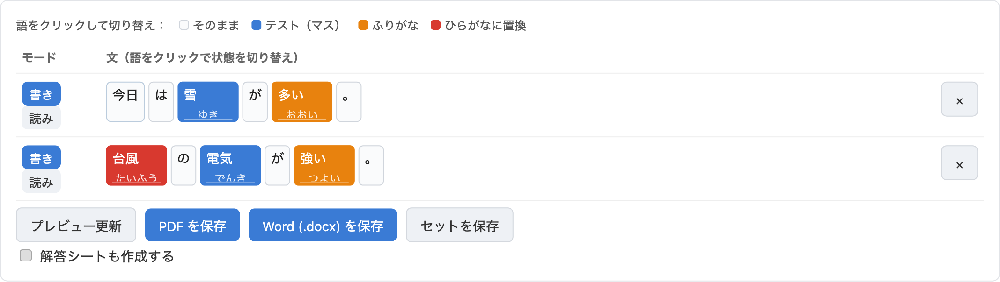
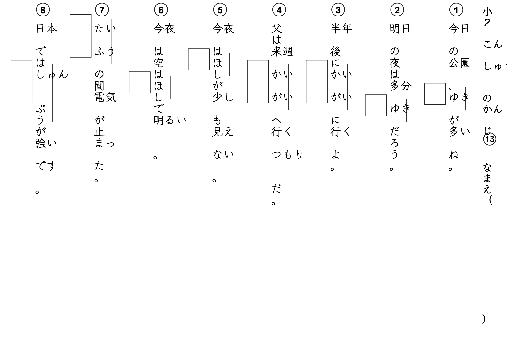

# 漢字テストメーカー · Kanji Test Maker

[English](README.md) | **日本語**

先生向けのブラウザツールです。日本語の文を貼り付けてテストする語を選ぶと、縦書きの
漢字テストを **PDF** と編集できる **Word (.docx)** で作成できます。フォントは .docx に
埋め込まれるので、どの環境でも正しく表示されます。

アカウント不要、サーバー処理なし、ビルド不要。解析・レイアウト・PDF・.docx・フォント
埋め込みは、すべてブラウザ内で動作します。

## 今すぐ使う

**https://hikashop-nicolas.github.io/kanji-test-maker/** をブラウザで開くだけ。
インストールは不要です。

## できること

自分で文を貼り付けることも、**学年からそのまま作る**こともできます。学年を選び、
今週の漢字を選ぶと、例文を自動で探します。

**1. レベルを選んで漢字を選ぶ。** 学年または JLPT レベル（N5〜N1）を選びます。表は
画数順、つぎに部首順（先生が探しやすい順）で並びます。クリックで選ぶか、ほかの
レベルの漢字も含めて直接入力できます。



**2. ランク付けされた例文から選ぶ。** 漢字ごとに、やさしく定着しやすい文が上位に来る
よう並びます。対象の漢字は強調表示されます。「やさしい文だけ」で学年以下の漢字の文に
絞れます。



**3. 表で調整する。** チェックした文は編集表に入り、レッスンの漢字だけがマークされ
ます。語をクリックすると状態が切り替わり、読みを直したり、文ごとに 書き／読み を
切り替えたりできます。自分の文を追加で貼り付けることもできます。各語には4つの状態が
あります。

- そのまま（グレー）：漢字をそのまま表示。
- テスト（青）：マス（解答欄）になります。
- ふりがな（オレンジ）：漢字はそのまま、ふりがなを付けます。
- ひらがな（赤）：漢字を読みに置き換えます（学年より上の語向け）。レッスンの文を
  追加すると、学年より上の語は自動でこの状態になります。



**4. テストを作成する。** きれいに印刷できる PDF か、編集できる .docx を保存します。
解答欄と丸数字のある縦書きの定番レイアウトです。「解答シートも作成する」に
チェックすると、解答（マスを埋めたもの）も書き出せます。



「**セットを保存**」でシート全体を保存し、「**セットを読み込み**」であとから開けます。

## 主な機能

- **レッスン自動入力。** 学年（小1〜小6 または中学以降の常用漢字）**または JLPT
  レベル（N5〜N1）**を選び、画数・部首順の表から今週の漢字を選ぶと、そのレベルに
  合わせて読みやすさでランク付けした例文が得られます。出典は KANJIDIC2、JLPT
  レベル（再構成版）、Tatoeba（`THIRD_PARTY.md` 参照）。市販教科書の文は含みません。
  JLPT のリストは公式ではありません（2010年以降、公式リストは非公開）。
- **貼り付けてマーク。** 1行に1文で貼り付けると、漢字の語を自動で検出・選択。
  クリックで切り替え、読みは編集できます。
- **語の4状態。** クリックで そのまま／テスト／ふりがな／ひらがな を切り替え。
  ふりがなは PDF・.docx ともに本物のルビとして出力されます。
- **文ごとの 書き／読み。** 書きは読みを表示して漢字を書くマス、読みは漢字を表示
  して読みを書くマス。
- **解答シート。** チェック1つで、すべてのマスを埋めた解答（書きは漢字、読みは
  読み）を別の PDF・.docx として書き出します。
- **セットの保存／読み込み。** シート全体（文・語の状態・ヘッダー・設定）を小さな
  `.ktm.json` に保存し、あとから修正・再印刷できます。
- **ワークシートの追加要素。** 点数欄と保護者印の欄（最終ページ、名前の下）、左下の
  ロゴ／画像（ブラウザに保存）、複数ページのときの自動ページ番号（1 / N）を任意で
  追加できます。タイトルは最初のページにのみ表示されます。
- **縦書きレイアウト。** タイトル列、右から左の文、傍線つきの対象語、揃った解答欄、
  丸数字、名前欄。
- **2つの出力。** 印刷に最適な PDF と編集できる .docx。選んだフォントは .docx に
  埋め込まれ、相手の環境に未インストールでも表示されます。
- **フォント。** Google の日本語フォント（標準は Klee One。低学年向けの手書き／
  教科書体。ほかに LINE Seed JP、Zen 角ゴ／丸ゴ、Kaisei Tokumin、Yuji Syuku）、
  または自分のフォントをアップロード。
- **表示言語。** 画面表示は日本語・英語・フランス語に対応（ブラウザの言語を自動判定、
  上部バーで切り替え、localStorage に保存）。テストの内容は日本語のままです。
- **設定の保存。** クラス・レッスン・名前・1ページの文数・フォント・サイズを
  localStorage に保存。

## ローカルで動かす

静的サイトですが、kuromoji の辞書とフォントを取得するため、HTTP 配信が必要です
（ファイルを直接開くと動きません）。

```bash
npm run serve
# python3 tools/devserver.py（:8799 で配信、no-cache）
# http://localhost:8799/index.html を開く
```

任意の静的サーバーで動きます（`python3 -m http.server` など）。`serve` は編集中に
便利な no-cache ヘッダーを付けるだけです。

## 公開（GitHub Pages）

静的サイトなので、リポジトリを push して Pages を有効にするだけです。`main` への
push ごとにリポジトリ直下を公開するワークフロー（`.github/workflows/deploy.yml`）を
同梱しています。`node_modules/` は gitignore 済みで、実行時には不要です（ライブラリは
`vendor/` に同梱）。

注：画面表示用の Google Fonts は Google の CDN から読み込むため、プレビューには
インターネットが必要です。.docx のフォント埋め込みは `assets/fonts/` のローカル
コピーを使うので、オフラインでも動作します。

## 使い方

（学年→漢字→例文の流れは上の「できること」を参照。以下は自分の文を貼り付ける
場合です。）

1. ヘッダー（クラス、今週のタイトル、レッスン番号、名前ラベル）を入力。
2. 1行に1文、漢字を含めて自然に貼り付け。
3. 「**解析する**」をクリック。表で語をクリックして状態（そのまま／テスト／
   ふりがな／ひらがな）を切り替え、文ごとに 書き／読み を切り替え。読みはその場で
   修正できます。
4. オプションを調整：1ページの文数、フォント、文字サイズ、マスの大きさ。
5. 「**PDF を保存**」（ブラウザ印刷→PDFとして保存）または「**Word (.docx) を保存**」。
   解答は「**解答シートも作成する**」にチェック。「**セットを保存**」／
   「**セットを読み込み**」であとから使えます。

すぐ貼り付けられる例文集は `test_sentences.md` を参照。

## 仕組み

```
貼り付け → kuromoji（トークン＋読み） → 編集表
        → buildLayout()（抽象レイアウト）
        → htmlExport（縦書き HTML）  → プレビュー／印刷 → PDF
        → docxExport（縦書きテーブル） → docx.js → JSZip（フォント埋め込みフラグ） → .docx
```

- `src/model.js` — トークン→ワークシートのレイアウト（自動選択、隣接漢字の結合、
  書き／読み、マス位置、丸数字、タイトルの全角数字）。
- `src/htmlExport.js` — レイアウト→縦書き HTML（プレビュー＋PDF）。
- `src/docxExport.js` — レイアウト→.docx（縦書きテーブル、埋め込みフォント）。
- `src/docxEmbed.js` — Word に必要な `<w:embedTrueTypeFonts/>` フラグを付与。
- `src/app.js` — UI（kuromoji、表、設定、書き出し、レッスン選択）。
- `src/lesson.js` — 学年→漢字表、選択（グリッド＋編集できる入力欄）。
- `src/sentences.js` — 例文のスコアリング（i+1 ランキング）＋候補一覧。
- `src/i18n.js` — 画面の翻訳（ja/en/fr）＋言語切り替え。
- `vendor/` — kuromoji.js、docx、JSZip（ビルド不要）。
- `assets/dict/` — kuromoji 辞書
- `assets/fonts/` — 埋め込み用 TTF。
- `assets/data/` — 生成されたレッスンデータ（漢字インデックス＋学年別の例文）。
- `tools/gen.mjs` — ブラウザなしで出力を生成する Node ハーネス。

### レッスンデータの再生成

`assets/data/` のファイルは生成物で、コミット済みです（GitHub Pages がそのまま配信）。
ソースから再生成するには：

```bash
npm run build:data     # tools/build-data.mjs（KANJIDIC2）＋ build-sentences.mjs（Tatoeba）
```

`build-data.mjs` は KANJIDIC2 から `assets/data/kanji.json`（学年・画数・部首・読み）を
生成し、davidluzgouveia/kanji-data から各漢字の JLPT レベル（N5〜N1、再構成版）を
加えます。`build-sentences.mjs` は Tatoeba 日本語コーパスから学年別の例文インデックスを
生成し、Tatoeba に例文のない稀な漢字には `tools/manual-sentences.json` のオリジナル例文
（約39文）を加えます。どちらもダウンロードを `tools/data-cache/`（gitignore 済み）に
キャッシュします。データのライセンスは `THIRD_PARTY.md` を参照（KANJIDIC2 は
CC BY-SA 4.0、Tatoeba は CC BY 2.0 FR）。

## 注意・制限

- .docx のフォント埋め込みは、サブセット化せずフォント全体（約1.5〜5MB）を各ファイルに
  追加します。最も軽い忠実な出力は PDF です。
- .docx はフォントを名前で参照し、埋め込みコピーは未インストールの相手向けです。
- 文字やマスを大きくすると、とても長い文は1列に収まらないことがあります。サイズを
  下げるか、文を分けてください。

## ライセンス

ソースコードは MIT（`LICENSE` 参照）。同梱のライブラリ・辞書・フォント・レッスン
データは、それぞれのライセンスに従います（`THIRD_PARTY.md` 参照。フォントは
SIL OFL 1.1（`assets/fonts/OFL.txt`）、漢字データは KANJIDIC2 CC BY-SA 4.0、例文は
Tatoeba CC BY 2.0 FR）。
