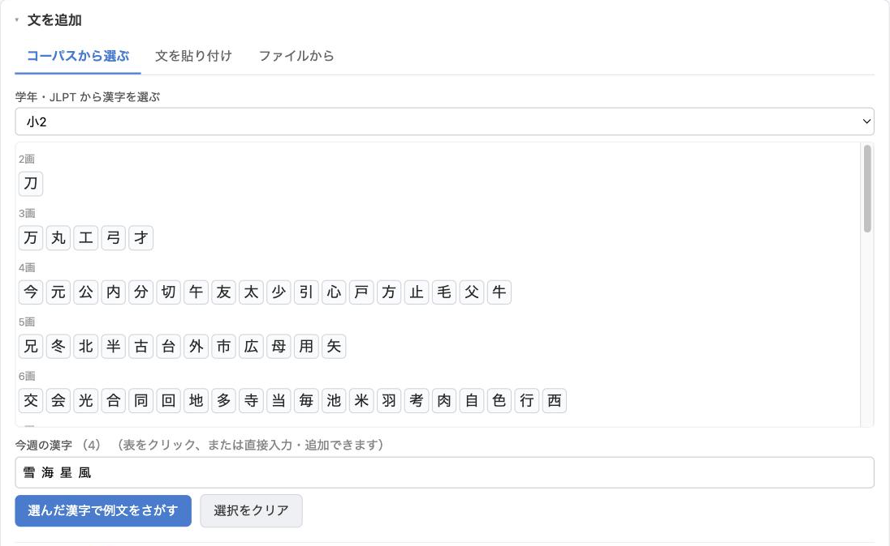
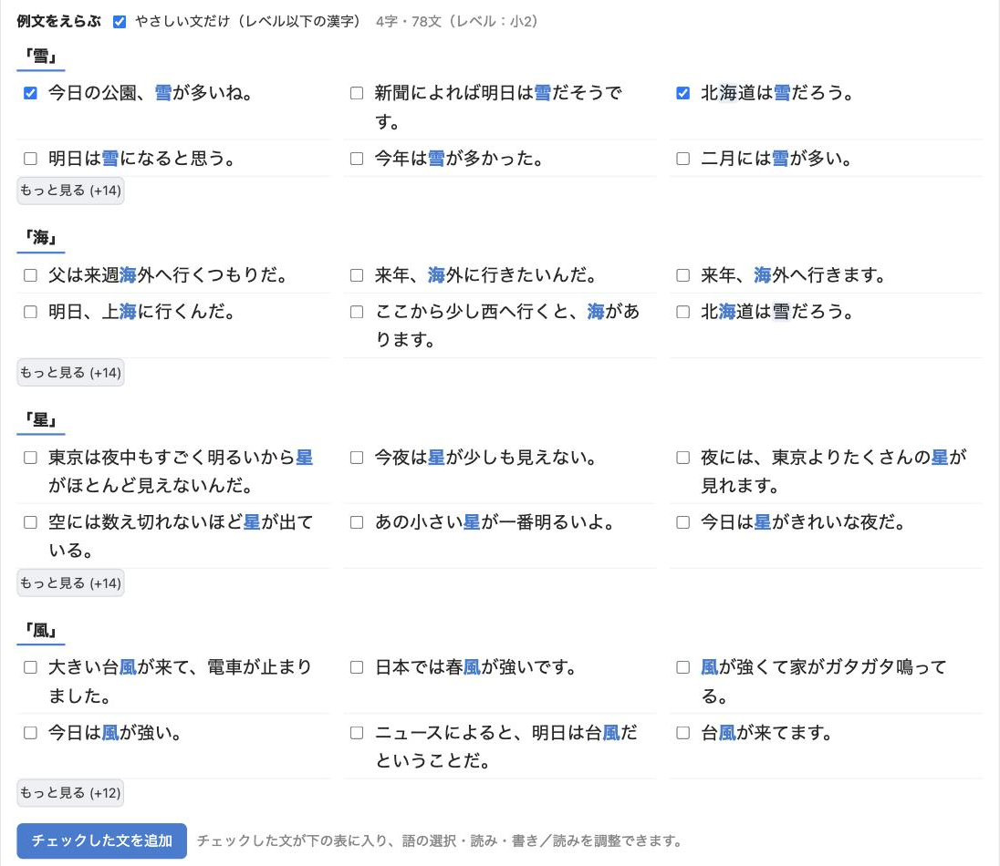
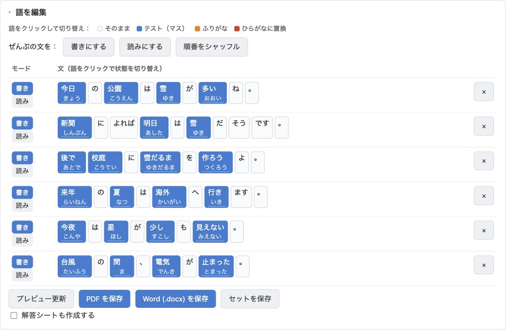
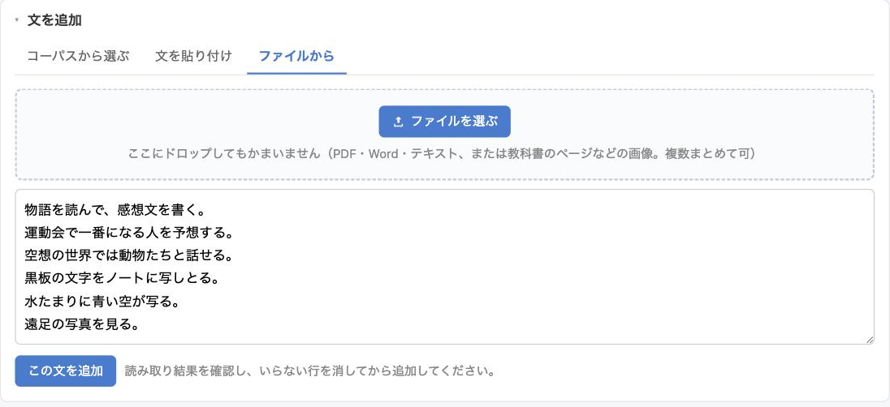

# 漢字テストメーカー · Kanji Test Maker

[English](README.md) | **日本語**

今週の漢字テストが数分でできます。漢字を選び、例文を選ぶか自分の文を持ち込むと、
縦書きのプリントが **PDF** と、編集できる **Word (.docx)** ででき上がります。
解答シートも必要なら一緒に作れます。

**→ [開く](https://hikashop-nicolas.github.io/kanji-test-maker/)** ·
無料・アカウント不要・インストール不要。

処理はすべてブラウザの中で行われます。入力した文もスキャンした画像もでき上がった
プリントも、パソコンの外に出ることはありません。

## いちばん短い手順

1. 学年を選び、出題する漢字をクリックする。
2. 使いたい例文にチェックを入れる。
3. 「**PDF を保存**」。

これだけでプリントが1枚でき上がります。以下はもっと細かく決めたいときの説明です。

## テストを作る

画面表示は日本語・英語・フランス語に対応し、ブラウザの言語に合わせて表示され、
右上のメニューで切り替えられます。プリントの内容はもちろん日本語です。

### 1. 漢字を選ぶ

学年（小1〜小6、または中学以降の常用漢字）か JLPT レベル（N5〜N1）を選びます。表は
画数順、つぎに部首順という、先生が探しやすい順に並びます。クリックで選ぶか、ほかの
レベルの漢字も含めて直接入力できます。

### 2. 例文を選ぶ

漢字ごとに、やさしく使いやすい文が上に来るように並び、対象の漢字が強調表示されます。
使いたい文にチェックを入れてください。「やさしい文だけ」にチェックすると、選んだ
レベルより上の漢字を含む文を隠せます。

### 3. 語を調整する

チェックした文は編集表に入り、レッスンの漢字にはすでにマークが付いています。語を
クリックすると、その語の扱いが切り替わります。

- **そのまま**（グレー）：書かれたまま印刷します。
- **テスト**（青）：解答欄（マス）になります。
- **ふりがな**（オレンジ）：漢字はそのままで、読みを横に添えます。
- **ひらがなに置換**（赤）：漢字を読みに置き換えます。レベルより上の語のための状態で、
  コーパスから追加した文は最初からこの状態になっています。

文ごとに **書き**（読みを見せて漢字を書かせる）か **読み**（漢字を見せて読みを
書かせる）かを選べます。表の上のボタンは**すべての文**をまとめて切り替えるので、同じ
文のセットから書きのテストと読みのテストが作れます。「**順番をシャッフル**」を押すと
並びが変わり、番号も付け直します。同じ語で2枚目を作っても、1枚目を覚えたまま答えられ
なくなります。

読みが違っていたら、その場で直せます。とくに間違えやすいのは、まだ習っていない漢字を
ひらがなで書いた語です。「あま酒」は辞書にない語なので「酒」だけが単独で読まれ、
「ざけ」ではなく「しゅ」になります。そうしたときは読みの横に破線の候補（「甘酒」から
取った「ざけ」）が出るので、クリックすればそれに置き換わります。

### 4. 保存する

「**PDF を保存**」で印刷用の PDF、「**Word (.docx) を保存**」で編集できる文書ができ
ます。.docx にはフォントが埋め込まれるので、そのフォントが入っていないパソコンでも
正しく表示されます。「**解答シートも作成する**」にチェックすると、すべてのマスを
埋めた解答シートも一緒にでき上がります。

## 自分の文を使う

### 貼り付ける

「**文を貼り付け**」タブに1行1文で、ふつうに漢字を使って入力し、「**解析する**」を
クリックします。漢字の語は自動で検出・マークされ、あとは同じ表で調整できます。すぐ
試せる例文集は `test_sentences.md` にあります。

### ファイルから読み取る

「**ファイルから**」タブでは、PDF、Word 文書（`.docx` と古い `.doc`）、OpenDocument の
`.odt`、テキストファイル `.txt`、そして教科書のページや古いプリントの写真・スキャンを
読み取れます。

枠にドロップするか、ボタンから選びます。複数まとめてもかまいません。プリントを
スキャンすると1ページ1ファイルになりますが、そのまま全部入れられます。渡した時点で
読み取りが始まり、渡した順に1つずつ処理して、読めた文が下に追加されていきます。
目を通し、いらない行を消してから表に追加してください。

文字データを持っているファイルは、縦書きも含めて、入力されたとおりの文がそのまま
取り出せます。Word や Excel で作られた PDF、Word や OpenDocument の文書、テキスト
ファイルがこれにあたります。Shift_JIS や EUC で保存された古いテキストも判別するので、
文字化けにはなりません。

文字データがないのはスキャンした画像だけです。そうしたページと写真は文字認識に
かけます。縦書きか横書きかは自動で判断し、縦書きの紙を横向きにスキャンしてしまった
場合も、向きを直してから読み取ります。判断がつかないときは4つの向きの見本を出すので、
読める向きを選んでください。家庭用スキャナーでは認識は完璧ではないので、追加する前に
目を通してください。長い文書は最初の 300 文までにとどめます。

## プリントの見た目

「**見た目・レイアウト**」で設定できます。

- **1ページの文数。** 「**自動**」のままなら、ページに入るだけ配置します。チェックを
  外すと文数を指定できます。
- **1ページの段数。** 1段（列が全高）か、2段に積むかを選べます。短い文は1段だと
  ページの下が空いてしまうので、2段にすると埋まります。
- **マスの位置。** 文中（日本で一般的な配置で、既定）に置き、漢字の位置にマス、その
  横に読みを入れるか、横の欄に置くかを選べます。出題する語が多くて1列に収まらない文
  には、その隣にもう1列マスが並びます。マスが消えることはありません。
- **フォントとサイズ。** 日本語フォント6種（既定は Klee One。手書きに近い字形で低学年
  向き）、パソコンに入っているフォント、またはアップロードしたフォントファイルが
  使えます。文字の大きさとマスの大きさは別々に指定できます。
- **追加要素。** 名前の下の点数欄・保護者印の欄と、左下の画像（学校のロゴなど）。文は
  画像を避けて配置されます。複数ページのときのページ番号は自動で付きます。

見出しそのものも省けます。「テスト情報」の「**シートに見出しを入れる**」のチェックを
外すと、クラス・タイトル・名前の欄が消え、その1列分が文にまわります。自分の練習用に
作るシートには、提出する相手がいません。

文がページに収まらないときは、黙って消さずにプレビューが赤字で知らせます。文字や
マスを小さくするか、段数を増やしてください。

## 作業を残す

「**セットを保存**」で、文・語の状態・見出し・レイアウトを含むシート全体を、小さな
`.ktm.json` ファイルとして保存できます。「**セットを読み込み**」であとから開いて、
修正や再印刷ができます。見出しとレイアウトの設定は次に開いたときにも残り、作業中に
アプリの新しい版が出て更新しても、作りかけのシートは失われません。

アプリとしてパソコンに追加することもできます。リンクを開き、ブラウザのインストール
ボタン（Chrome ならアドレスバー右のアイコン、Safari ならファイル ▸ Dock に追加）を
使ってください。独立したウィンドウで開き、インターネットがなくても使えます。辞書・
フォント・文字認識のモデルは大きいため、必要になったときに取得して保存します。

## 知っておくとよいこと

- 例文は Tatoeba のコーパスから、ネイティブまたは上級話者が書いた文に絞って使って
  います。このプロジェクトで書き下ろした文も含みます。市販教科書の文は使っていません。
- JLPT のリストは公式のものではなく、再構成版です。2010年以降、公式リストは公開されて
  いません。
- .docx にはフォント全体が入るため、ファイルが 1.5〜5MB ほど大きくなります。PDF の
  ほうがずっと軽くなります。
- 文字やマスを大きくすると、とても長い文は1列に収まらないことがあります。サイズを
  下げるか、段数を増やすか、文を分けてください。

## 開発者向け

ローカルでの動かし方、ファイル構成、レッスンデータの生成については
[docs/DEVELOPING.md](docs/DEVELOPING.md)（英語）を参照してください。

## ライセンス

ソースコードは MIT（`LICENSE` 参照）。同梱のライブラリ・辞書・フォント・レッスン
データは、それぞれのライセンスに従います（`THIRD_PARTY.md` 参照）。フォントは
SIL OFL 1.1、漢字データは KANJIDIC2（CC BY-SA 4.0）、例文は Tatoeba（CC BY 2.0 FR）
です。
