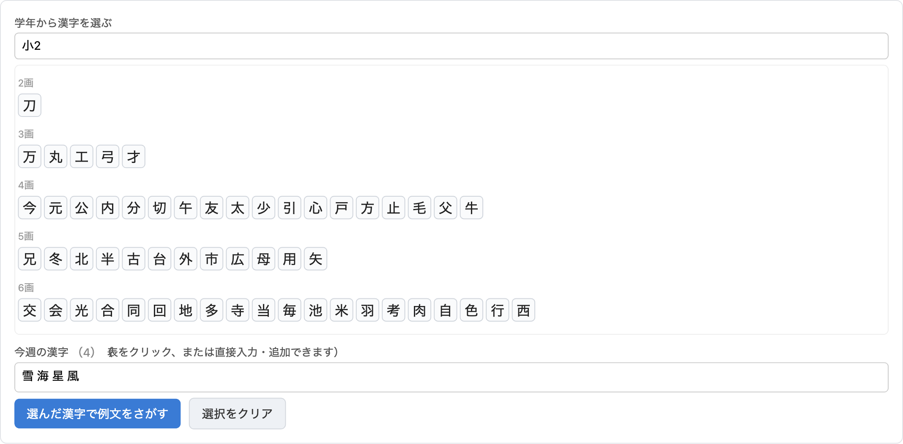
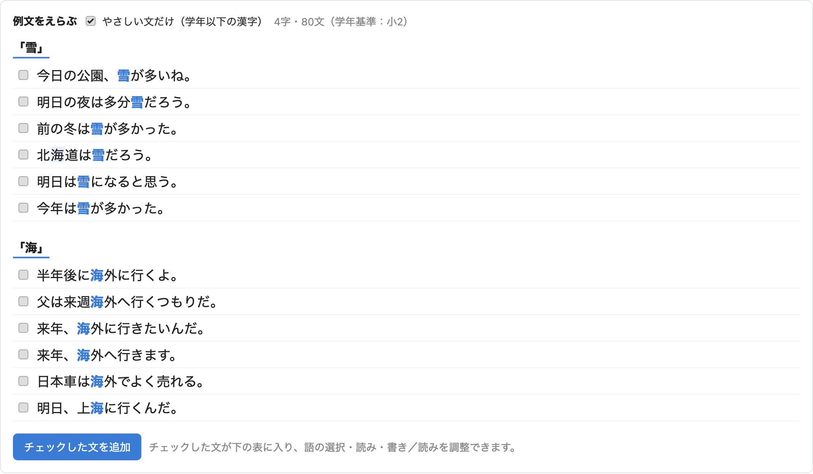
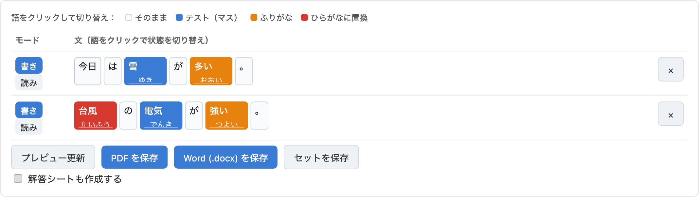
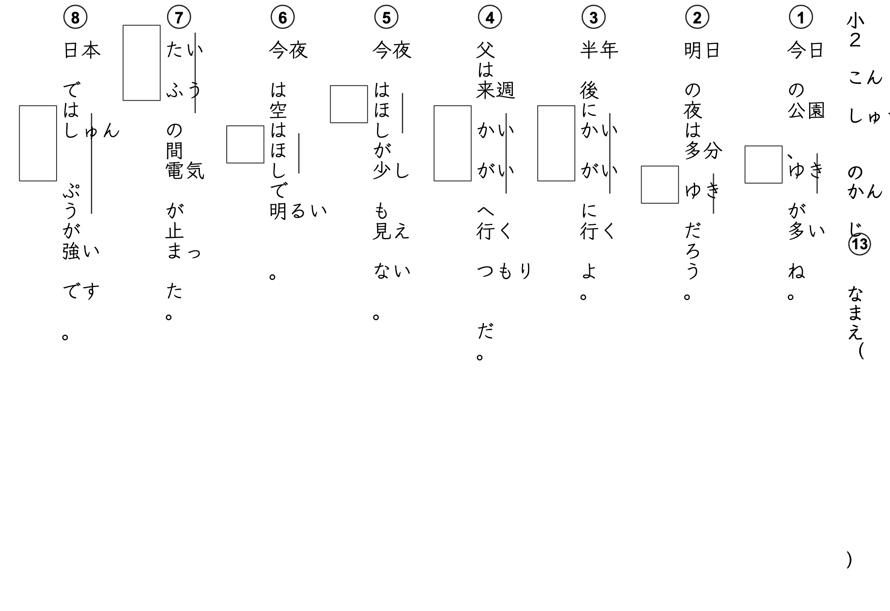

# 漢字テストメーカー · Kanji Test Maker

[English](README.md) | **日本語**

先生のための無料ツールです。今週の漢字を選ぶか、自分で文を貼り付けると、縦書きの
漢字テストが **PDF** と編集できる **Word (.docx)** でできあがります。解答シートも
必要なら作れます。

処理はすべてブラウザ内で行われます。アカウントは不要で、どこにもアップロードされず、
入力した文がパソコンの外に出ることはありません。

## 今すぐ使う

**https://hikashop-nicolas.github.io/kanji-test-maker/**

インストールは不要です。アプリとしてパソコンに追加することもできます。上のリンクを
開き、ブラウザのインストールボタン（Chrome ならアドレスバー右のアイコン、Safari なら
ファイル ▸ Dock に追加）を使ってください。ふつうのアプリと同じように独立した
ウィンドウで開き、インターネットがなくても使えます。

辞書・フォント・文字認識のデータは大きいため、最初にまとめてダウンロードすることは
しません。使ったときに保存され、それ以降はオフラインでも使えます。

## テストを作る

学年からそのまま作ることも、自分の文を貼り付けることもできます（後者は
[自分の文を使う](#自分の文を使う)を参照）。

**1. レベルを選び、漢字を選ぶ。** 学年（小1〜小6、または中学以降の常用漢字）か JLPT
レベル（N5〜N1）を選びます。表は画数順、つぎに部首順という、先生が探しやすい順に
並びます。クリックで選ぶか、ほかのレベルの漢字も含めて直接入力できます。

**2. 例文を選ぶ。** 漢字ごとに、やさしく定着しやすい文が上に来るように並び、対象の
漢字が強調表示されます。「やさしい文だけ」にチェックすると、そのレベル以下の漢字だけの
文に絞れます。

**3. 表で調整する。** チェックした文は編集表に入り、レッスンの漢字にはすでにマークが
付いています。語をクリックすると、その語の扱いが切り替わります。

- そのまま（グレー）：書かれたまま表示します。
- テスト（青）：解答欄（マス）になります。
- ふりがな（オレンジ）：漢字はそのままで、ふりがなを付けます。
- ひらがな（赤）：漢字を読みに置き換えます。例文から追加した文は、選んだレベルより
  上の語が最初からこの状態になっています。

文ごとに 書き（読みを見せて漢字を書かせる）か 読み（漢字を見せて読みを書かせる）かを
選べます。表の上のボタンは**すべての文**をまとめて切り替えるので、同じ文のセットから
書きのテストと読みのテストを、1文ずつ切り替えずに作れます。

解析が読みを取り違えたときは、その場で直せます。とくに間違えやすいのは、まだ習って
いない漢字をひらがなで書いた語です。「あま酒」は辞書にない語なので「酒」だけが単独で
読まれ、「ざけ」ではなく「しゅ」になります。そうしたときは読みの横に破線の候補
（「甘酒」から取った「ざけ」）が出るので、クリックすればそれに置き換わります。

**4. テストを保存する。** 「**PDF を保存**」で印刷用の PDF、「**Word (.docx) を保存**」で
編集できる文書ができます。.docx にはフォントが埋め込まれるので、そのフォントが入って
いないパソコンでも正しく表示されます。「**解答シートも作成する**」にチェックすると、
すべてのマスを埋めた解答シートも作れます。

## 自分の文を使う

**貼り付ける。** 「文を貼り付け」タブに1行1文で、ふつうに漢字を使って入力し、「解析する」を
クリックします。漢字の語は自動で検出・マークされ、あとは上と同じ表で調整できます。
すぐ試せる例文集は `test_sentences.md` にあります。

**ファイルから読み取る。** 「ファイルから」タブでは、PDF、Word 文書（`.docx` と
古い `.doc`）、OpenDocument の `.odt`、テキストファイル `.txt`、そして教科書の
ページや古いプリントの写真・スキャンから日本語を読み取れます。枠にドロップするか、
ボタンから選びます。複数まとめてもかまいません。プリントをスキャンすると1ページ
1ファイルになりますが、そのまま全部入れられます。並んでいる順に読み取るので、文も
ページの順に出てきます。ファイルがどこかに送られることはなく、お使いのパソコンの
中だけで処理されます。

文字データを持っているファイルは、縦書きも含めて、入力されたとおりの文がそのまま
取り出せます。Word や Excel で作られた PDF、Word や OpenDocument の文書、テキスト
ファイルがこれにあたります。Shift_JIS や EUC で保存された古いテキストも判別するので、
文字化けにはなりません。

文字データがないのはスキャンした画像だけです。そうしたページと画像は、文字認識に
かけます。縦書きか横書きかは自動で判断します。まず余白の走り方を見て見当をつけ、
次に実際に読ませてみて、ことばとして通る向きを採用します。縦書きの紙を横向きに
スキャンしてしまった場合も、向きを直してから読み取ります。判断がつかないときは、
4つの向きの見本を出すので、読める向きを選んでください。待たずに済ませたいときは
「向き」から「横書き」「縦書き」を直接指定できます。家庭用スキャナーでは認識は
完璧ではありません。

いずれの場合も読み取った行は編集できる欄に入るので、目を通して、おかしいところを
直すか消してから追加してください。長い文書は最初の 300 文までにとどめます。

## レイアウト

「見た目・レイアウト」で設定できます。

- **1ページの文数。** 「自動」のままなら、ページに入るだけ配置します。チェックを
  外すと、文数を指定できます。
- **1ページの段数。** 1段（列が全高）か、2段（短い文向け）を選べます。短い文は
  1段だとページの下半分が空いてしまいます。
- **マスの位置。** 文中（日本で一般的な配置で、既定）に置き、漢字の位置にマス、その
  横に読みを入れるか、横の欄に置くかを選べます。
- **フォントとサイズ。** 日本語フォント6種（既定は Klee One。手書きに近い字形で低学年
  向き）、パソコンに入っているフォント、またはアップロードしたフォントファイルが
  使えます。文字の大きさとマスの大きさは別々に指定できます。
- **追加要素。** 名前の下の点数欄・保護者印の欄と、左下のロゴ。複数ページのときの
  ページ番号は自動で付きます。

文がページに収まらないときは、黙って消さずにプレビューが赤字で知らせます。文字や
マスを小さくするか、段数を増やしてください。

## 保存と読み込み

「**セットを保存**」で、文・語の状態・ヘッダー・設定を含むシート全体を、小さな
`.ktm.json` ファイルとして保存できます。「**セットを読み込み**」であとから開いて、
修正や再印刷ができます。ヘッダーとレイアウトの設定は、次に開いたときにも残ります。

## 知っておくとよいこと

- 例文は Tatoeba のコーパスから、ネイティブまたは上級話者が書いた文に絞って使って
  います。このプロジェクトで書き下ろした文も含みます。市販教科書の文は使っていません。
- JLPT のリストは公式のものではなく、再構成版です。2010年以降、公式リストは公開されて
  いません。
- 画面表示は日本語・英語・フランス語に対応し、上部バーで切り替えられます。テストの
  内容はもちろん日本語です。
- .docx にはフォント全体が入るため、ファイルが 1.5〜5MB ほど大きくなります。PDF の
  ほうがずっと軽くなります。
- 文字やマスを大きくすると、とても長い文は1列に収まらないことがあります。サイズを
  下げるか、段数を増やすか、文を分けてください。

## 開発者向け

ローカルでの動かし方、ファイル構成、レッスンデータの生成については
[docs/DEVELOPING.md](docs/DEVELOPING.md)（英語）を参照してください。

## ライセンス

ソースコードは MIT（`LICENSE` 参照）。同梱のライブラリ・辞書・フォント・レッスン
データは、それぞれのライセンスに従います（`THIRD_PARTY.md` 参照）。フォントは
SIL OFL 1.1、漢字データは KANJIDIC2（CC BY-SA 4.0）、例文は Tatoeba（CC BY 2.0 FR）
です。
