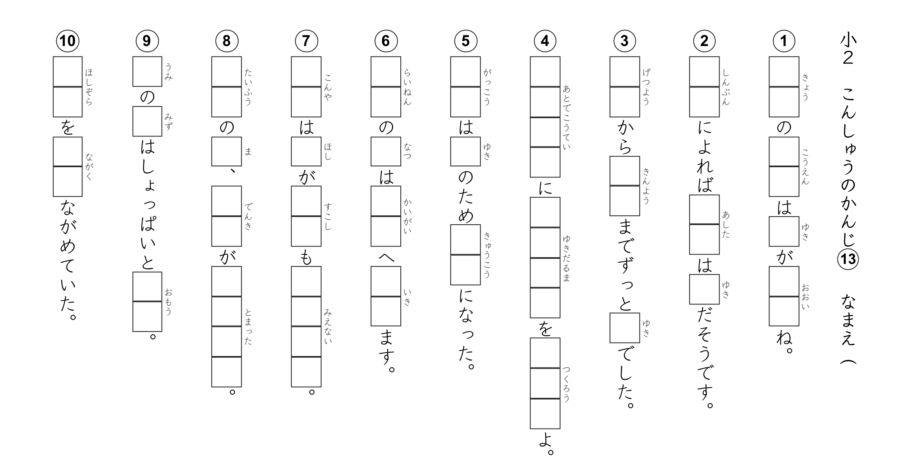
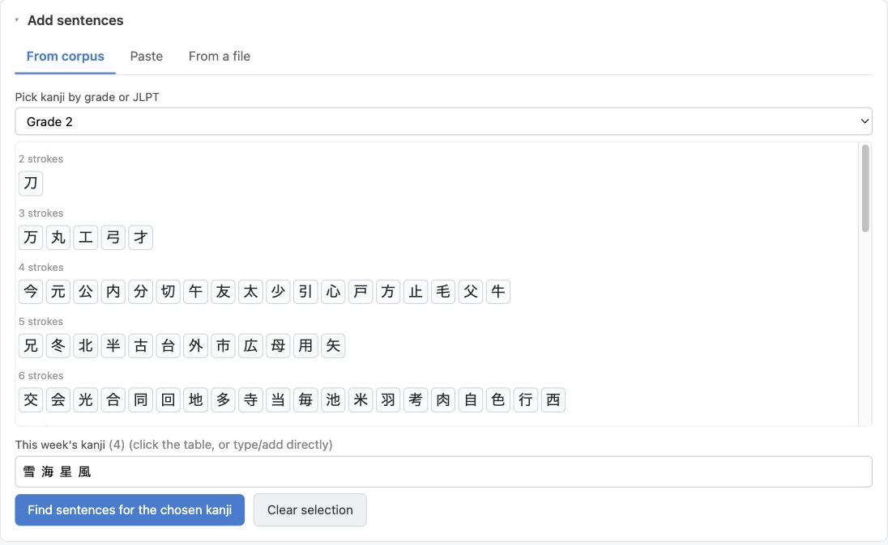
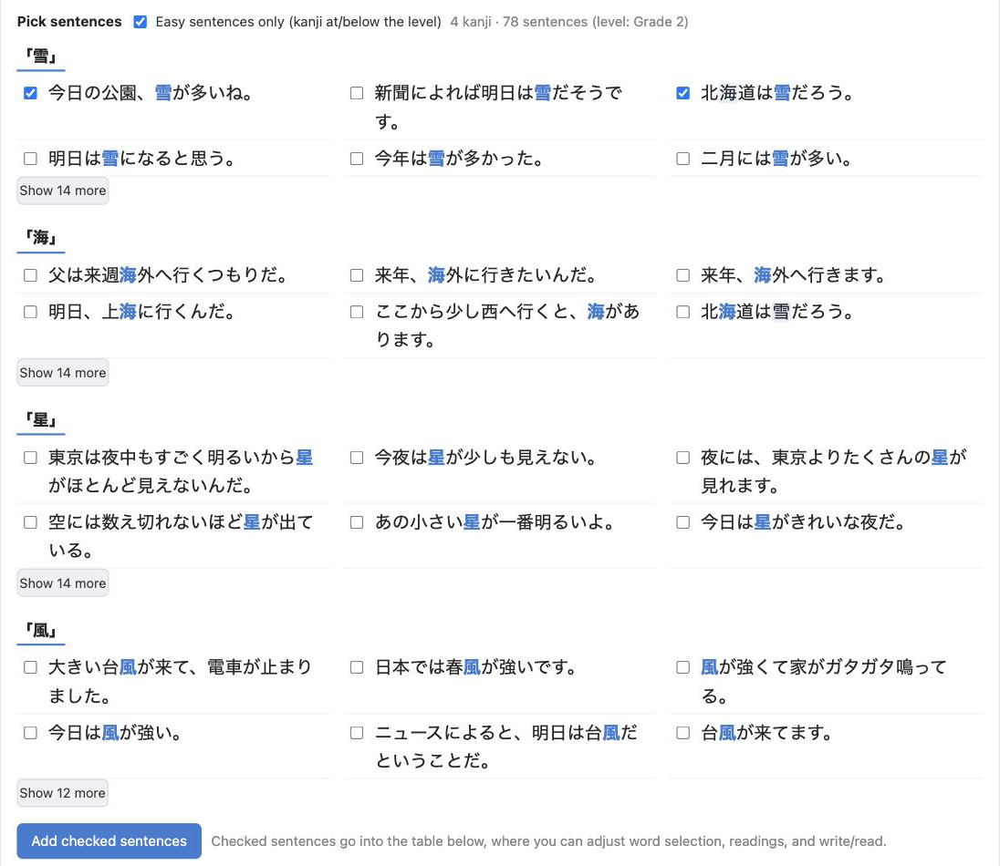
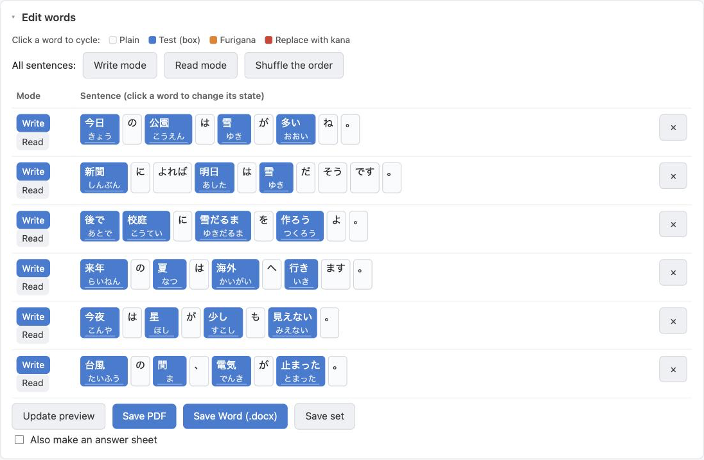
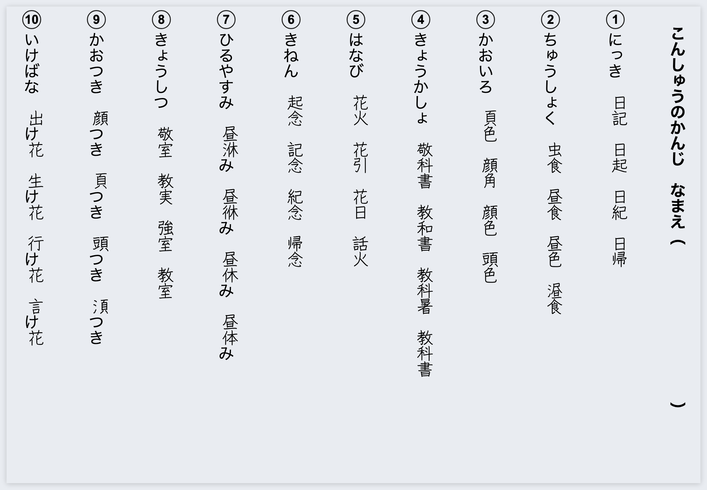
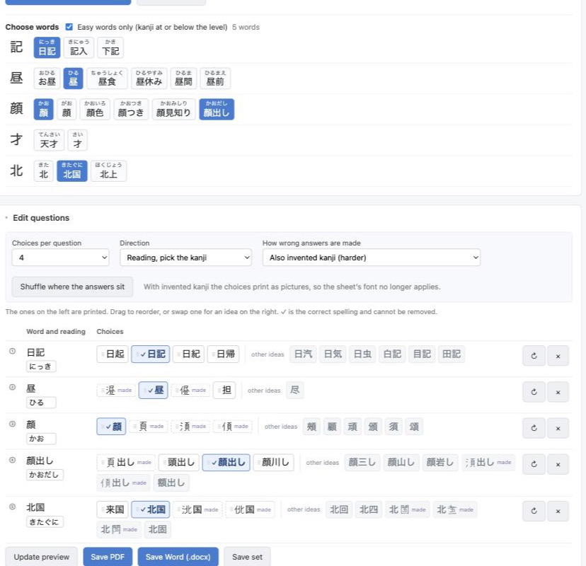
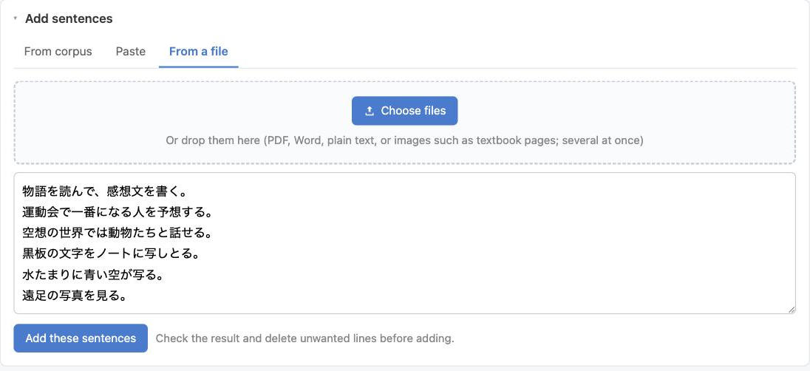

# Kanji Test Maker · 漢字テストメーカー

**English** | [日本語](README.ja.md)

Make this week's kanji worksheet in a couple of minutes. Pick the kanji, take
example sentences or bring your own, and get a vertical-writing (縦書き) sheet as
a **PDF** and as an editable **Word (.docx)**, with an answer key if you want
one.

**→ [Open it](https://hikashop-nicolas.github.io/kanji-test-maker/)** ·
free, no account, nothing to install.

Everything happens inside your browser. Your sentences, your scans and your
worksheets never leave your computer.

## The short version

1. Pick a grade, then click the kanji you are testing.
2. Tick the example sentences you like.
3. **Save PDF**.

That is a whole worksheet. Everything below is there when you want more
control, including a second kind of sheet where the pupil picks the right
spelling out of four.

## Making a worksheet

The app is in Japanese, English or French: it follows your browser, and the menu
at the top right changes it. The worksheets themselves are of course in
Japanese. The screenshots here are from the English interface.

### 1. Choose the kanji

Pick a school grade (Grade 1 to 6, or secondary jōyō) or a JLPT level (N5 to
N1). The table is ordered by stroke count, then radical, the way teachers scan
it. Click the ones you want, or type them straight into the field, including
kanji from other levels.

### 2. Choose sentences

Each kanji comes with example sentences, the easiest and most useful first, with
the kanji highlighted. Tick the ones you want. **Easy sentences only** hides
sentences that use kanji from above the level you picked.

### 3. Adjust the words

The sentences land in a table with the lesson's kanji already marked. Click any
word to change what happens to it:

- **Plain** (grey): printed as it is.
- **Test** (blue): becomes an answer box.
- **Furigana** (orange): the kanji stays, with its reading alongside.
- **Kana** (red): the kanji is replaced by its reading, for words above the
  level. Sentences taken from the corpus start with those already in red.

Each sentence is either **write** (the pupil sees the reading and writes the
kanji) or **read** (the pupil sees the kanji and writes the reading). The two
buttons above the table switch every sentence at once, so one set of sentences
gives you a write sheet and a read sheet. **Shuffle the order** renumbers them
into a new order, which is how you get a second sheet on the same words that
cannot be answered from memory of the first.

Got a reading wrong? Correct it in place. It happens most often when a word is
written half in kana, the way a worksheet spells a kanji the class has not met
yet: あま酒 is in no dictionary, so 酒 is read on its own and comes out しゅ
instead of ざけ. When that happens a dashed suggestion appears beside the
reading (ざけ, from 甘酒). Click it to take it.

### 4. Save it

**Save PDF** gives a print-ready sheet. **Save Word (.docx)** gives a document
you can edit, with the font packed inside so it looks right on a computer that
does not have that font. Tick **Also make an answer sheet** and you get the same
worksheet a second time with every box filled in.

## The other kind of test: multiple choice

The switch at the top of the page turns the whole app round: instead of
sentences it asks for **words**, and each word becomes a question with four or
five spellings of which one is right. The pupil rings the one they think is
correct.

**Choosing the words** works like choosing sentences. Pick your kanji, and each
one offers the words that use it, commonest first, with the reading above. Tick
the ones you want. You can also paste a list, or take the words out of a file or
a photograph, exactly as with sentences.

**The wrong spellings are made for you**, and they are meant to be hard. Every
one of them reads the same as the answer, so the reading gives nothing away
(かんじ: 漢字, 感字, 幹字, 漢自), or shares a component with it, which is the
confusion a pupil actually makes (待 against 持, 語 against 誤). They are picked
from kanji your class has already met: one built from a kanji they cannot read
is no distractor at all, because the answer would be the only line they can
read.

**Or invent the kanji.** Set **How wrong answers are made** to "Also invented
kanji" and the wrong spellings can be characters that do not exist: a real one
with a component taken away, another put in, or one exchanged. They are drawn
stroke by stroke, so they look like kanji the pupil has simply never seen, and
they are the only way to make a hard question out of 川 or 花, which have no
lookalikes to borrow. Two things come with it: every choice on the sheet is then
drawn, so your chosen font no longer applies, and in the `.docx` the choices are
pictures rather than text.

**Or turn the question round.** Set **Direction** to "Kanji, pick the reading"
and the pupil is given the word and picks its reading out of four. Those wrong
readings are the mistakes the writing system invites: a voicing added or
dropped, a long vowel lost, a small kana written large, or one character read by
another of its own readings.

**Everything is yours to change.** Each question shows the spellings that will
print and, beside them, more the app thought of. Drag to reorder, drag one in
from the right to swap it, or press ↻ for a fresh set. The correct spelling is
marked with a ✓ and cannot be removed: the app knows which one is right, so
there is nothing to choose there. **Shuffle where the answers sit** scatters
them again across every question.

**The reading sits under the word, and you can correct it.** The dictionary is
not always right: 新出 is in it only as a surname, so it comes back にいで rather
than しんしゅつ. Type over it and the wrong answers are rebuilt from what you
typed, since they are made out of the reading.

The answer sheet works as it does elsewhere: tick the box and you get the same
sheet with the correct spelling in red.

## Your own sentences

### Paste them

In the **Paste** tab, one sentence per line, written normally with kanji, then
**Analyze**. Kanji words are picked out for you and you carry on in the same
table. `test_sentences.md` has ready-made sets to try.

### Take them out of a file

The **From a file** tab reads a PDF, a Word document (`.docx` or the older
`.doc`), an OpenDocument `.odt`, a plain `.txt`, or a photo or scan of a
textbook page or an old worksheet.

Drop the files on the box, or pick them with the button, several at once if you
have them: scanning a workbook gives one file per page and the whole stack can
go in together. Reading starts straight away, one file at a time in the order
you gave them, and each file's sentences appear under the ones before. Read them
over, delete what you do not want, then add them to the table.

A file that carries its own text gives it up exactly as it was typed, vertical
writing included: a PDF made by Word or Excel, a Word or OpenDocument file, a
text file. Old text saved in Shift_JIS or EUC is recognised as such, so it does
not come out as mojibake.

Only a scan has no text to give. Those pages, and any photo, go through
character recognition. Which way the page reads is worked out for you: a 縦書き
sheet that went through the scanner sideways is turned the right way up on its
own. When the app cannot tell, it shows you the page the four ways round and
asks which one reads. Recognition is good but not perfect on a home scan, so
look the sentences over before adding them. A long document stops at the first
300 sentences.

## The look of the sheet

Under **Appearance & layout**:

- **Sentences per page.** Left on **auto**, the sheet fits as many as the page
  takes. Untick it to set an exact number.
- **Bands per page.** One band of full-height columns, or two shorter ones
  stacked. Short sentences leave the bottom of a one-band sheet empty; two bands
  fill it.
- **Where the blanks go.** In the sentence (the usual Japanese layout, and the
  default), with the boxes where the word goes and its reading alongside; or in
  a column beside the sentence. A sentence with more tested words than one
  column of boxes holds gets a second column beside the first, so no box is ever
  squeezed out.
- **Font and sizes.** Six Japanese fonts (Klee One by default, whose handwriting
  shapes suit lower grades), the fonts on your own computer, or a font file you
  upload. Text size and box size are separate.
- **Extras.** Score and parent's-seal boxes below the name, and a picture in the
  bottom-left corner (your school's logo, say) that the sentences keep clear of.
  Sheets over one page are numbered.

The heading is optional too: untick **Put a heading on the sheet** under
**Worksheet info** and the class, title and name line comes off, and the column
it stood in goes back to the sentences. A sheet someone makes to practise on has
no one to hand it in to.

If a sentence will not fit on the page, the preview says so in red rather than
dropping it quietly. Make the text or the boxes smaller, or add a band.

## Keeping your work

**Save set** writes the whole worksheet, sentences, word states, heading and
layout, into a small `.ktm.json` file. **Load set** opens it again later to
adjust or reprint. Your heading and layout settings are remembered between
visits, and if a new version of the app appears while you are working, taking it
does not cost you the sheet you were making.

You can also add the app to your computer: open the link and use your browser's
install button (the icon at the right of Chrome's address bar, or File ▸ Add to
Dock in Safari). It then opens in its own window and works without an internet
connection. The dictionary, fonts and recognition models are large, so they are
fetched the first time you need them and kept from then on.

## Good to know

- The example sentences come from the Tatoeba corpus, filtered to sentences
  written by native or fluent speakers, plus some written for this project. No
  textbook content is copied.
- The JLPT lists are unofficial reconstructions. No official list has been
  published since 2010.
- A `.docx` carries a full copy of the font, which adds 1.5 to 5 MB to the file.
  The PDF is much lighter.
- Very long sentences may not fit one column at a large text or box size. Make
  them smaller, add a band, or split the sentence.

## For developers

Running it locally, the project layout, and how the lesson data is generated:
see [docs/DEVELOPING.md](docs/DEVELOPING.md).

## License

Source code: MIT (see `LICENSE`). The bundled libraries, dictionary, fonts and
lesson data keep their own licenses, listed in `THIRD_PARTY.md`: fonts are SIL
OFL 1.1, kanji data is KANJIDIC2 (CC BY-SA 4.0), example sentences are Tatoeba
(CC BY 2.0 FR).
