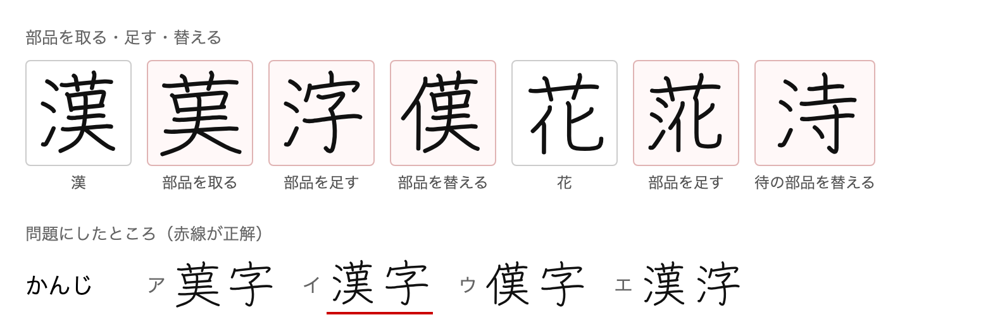
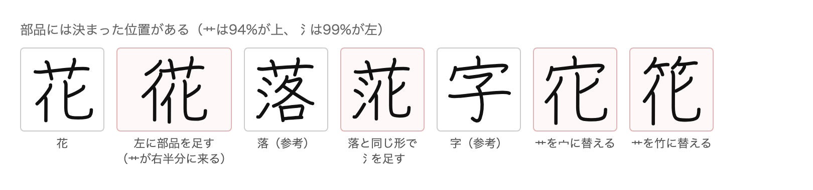
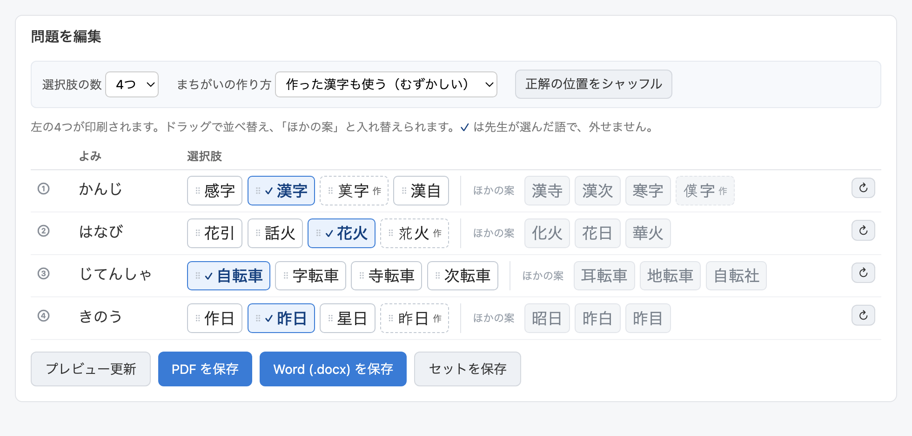
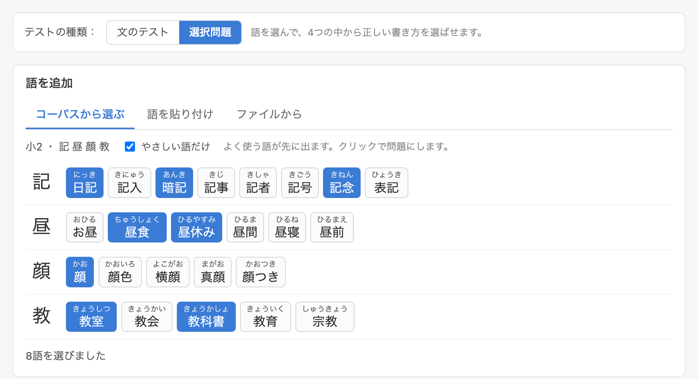
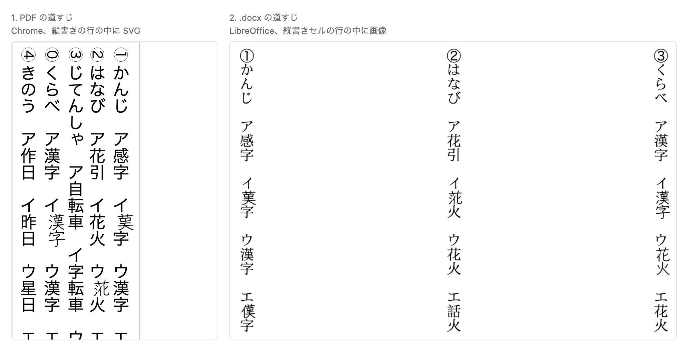

# Multiple-choice sheets, plan

Built. This was the design document, and it is kept because the reasoning behind
several decisions is not obvious from the code: why a wrong spelling that is
itself a word has to go, why a borrowed component is never scaled, why the sheet
is one band. Every number and figure came from a prototype run against the data
the app ships. What shipped differs from the draft in one place, noted in 5.1:
the sheet kind is a switch at the top rather than a third mode beside 書き and
読み.

## 1. What it is

A third kind of sheet, beside the 書き and 読み worksheets: a list of words, each
with four or five spellings, of which one is right.

```
①  かんじ      ア 莫字    イ 漢字    ウ 感字    エ 漢浮
```

No sentences. Each question is a reading and its candidate spellings, and the
pupil marks the correct one.

## 2. Where it fits

The teacher picks kanji exactly as now. From there the app takes a different
branch: it offers words rather than sentences, turns each chosen word into a
question, and prints a word list. The lesson picker, the heading, the layout,
the preview, the answer sheet, the saved `.ktm.json` and both exporters are all
the same machinery. In the vertical layout a question is simply a column, the
reading at the top and the choices below it, so the existing column and band
code lays the page out with no new geometry.

## 3. Making a wrong spelling

Three ways, in the order the generator should try them.

### 3.1 Swap a whole character, same sound

The reading must give nothing away: every spelling has to read かんじ. To swap a
character for one that sounds the same we need to know what each contributes:
漢字 = カン + ジ. The split is a backtracking match of the word's reading against
each character's on and kun readings, including the sound changes a compound
makes:

- 連濁: 物語 = モノ + **ガ**タリ (かたり voiced)
- 促音便: 学校 = ガ**ッ** + コウ (ガク clipped)
- 半濁: 発表 = ハ**ッ** + **ピ**ョウ

Words with no such split are 熟字訓, spellings not built from their characters
at all (昨日 きのう, 大人 おとな). They lose this axis, and only this one: the
shape route below still works, so 昨日 gets 作日, 星日, 昭日. That is the right
answer for them anyway, since a pupil cannot reason from the reading either and
simply has to know the spelling.

### 3.2 Swap a whole character, same shape

Every kanji in KanjiVG carries its component tree, so a character that is the
same but for one component is a lookup, not a guess:

| Kanji | Same but for one component |
|---|---|
| 待 | 持 律 時 特 往 径 徒 |
| 語 | 誌 認 誤 説 読 試 詩 話 |
| 字 | 好 宅 宇 守 安 孝 完 |
| 校 | 株 根 格 桜 梅 柱 |
| 犬 | 太 丸 玉 求 奈 |
| 貝 | 具 見 典 員 負 |

This replaces the radical-and-stroke-count guess an earlier draft used, and it
is much better: 待 against 持 is the confusion a pupil actually makes.

### 3.3 Score them together

A candidate is ranked on: same sound (+10), shares a component with the
character it replaces (+8), and whether the pupil can read it (+12 at or below
the lesson's level, +5 kyōiku above it, +1 otherwise). The best distractor is
one that is both homophone and lookalike; the level weight is what stops the
generator reaching for kanji the class has never seen, which would leave the
answer as the only readable line.

A candidate that is itself a real word is dropped (詠む against 読む, 家事
against 火事). On a sheet with no sentences there is no context to rule the
other word out, so this is a requirement rather than a preference.

### 3.4 What that covers

Measured over the words in the app's own lesson data, using only real
characters:

| | words tested | got 3 distractors | 1 or 2 | none |
|---|---|---|---|---|
| Grade 2 | 319 | **74%** | 49 | 33 |
| Grade 4 | 821 | **88%** | 59 | 37 |

The gap is at the bottom, which is the awkward part: the simplest characters are
the ones a grade 1 or 2 sheet is made of, and 55 of the 240 kanji up to grade 2
(川, 山, 土, 木, 目) have no component split at all and few homophones a child
would know. Those are exactly the questions that need the next section.

### 3.5 The lookalikes nothing else finds

A short hand-written table covers the characters where sound and shape both come
up empty, which are the simplest and therefore the lowest grades: 犬大太, 土士,
千干午, 本木末未, 日白目, 石右, 川州, 貝見, 未末, 己已巳. A few dozen groups is
the whole of it, and it is the sort of list a teacher can extend.

## 4. Fabricating a character



The pink cells above are not characters. They have no codepoint and could not
be typed. KanjiVG gives every kanji as stroke paths grouped by component with
its position, which makes three operations possible, all prototyped and all in
the figure:

- **Take a component away.** 漢 without the 氵, with what remains rewritten at
  full size. This was the suggestion that started this section and it is the
  most convincing of the three.
- **Put a component in.** 字 narrowed to the right of a borrowed 氵.
- **Swap a component.** 氵 replaced by 亻.

Stroke-level edits (adding or removing a single stroke) were tried first and
**dropped**: at print size they read as a printing error rather than as a wrong
character, and they test spot-the-difference rather than knowing the kanji.

### 4.1 Two rules the drawing has to follow

Both were found by getting them wrong, and both are visible at a glance when
broken.

**A borrowed component is copied at its own size, never fitted to the slot.**
Every kanji is drawn in the same square, so a left radical already sits at
x 11 to 36 whichever kanji it came from: 氵 in 漢 is 15 to 30, 亻 in 休 is 10 to
35, 彳 in 待 is 11 to 36. Scaling one into the other's bounding box is what made
the first attempt look wrong, since it squeezed a component that was already
the right size.

**The transform goes into the path data, not onto the group.** A scaled group
carries its stroke width with it, so a narrowed element comes out with thinner
strokes than the rest of the character. Since KanjiVG uses only M/m/c/C/s/S,
every number is part of an x,y pair and the affine can be baked into the path
itself, leaving one stroke width for the whole glyph. `vector-effect:
non-scaling-stroke` looks like the fix and is not: it ignores the viewBox too,
so the fabricated glyphs come out heavier than their neighbours, and worse the
smaller the sheet.

That also lets an element be narrowed without being shrunk, which is what a
character does when it moves beside a radical: 字 on its own is 84 wide and 92
tall, and beside a 氵 it has to become 62 wide while staying 92 tall. A uniform
scale would make it 74% of its height as well, and it reads as too small.
Anisotropy is capped at 1.45 so nothing turns into a caricature.

### 4.2 Which operation suits which kanji

The operation has to match how crowded the character already is:

| Kanji | Lean on | Why |
|---|---|---|
| Few strokes (under about 7) | **Put a component in**, or swap the whole character | There is nothing to take away, and often no component to swap: 川, 山, 土 have no split at all. Room is what they have |
| Many strokes (over about 12) | **Take a component away**, **swap one**, or swap the whole character | Adding to a character that is already dense gives a blot no one would mistake for a kanji |
| In between | Whatever scores best | |

### 4.3 A component only goes where it belongs



Components have strong positional habits, and they are in the data: across every
kanji that uses it, 艹 is at the top 94% of the time, 竹 99%, 雨 97%, while 氵 is
on the left 99% and 彳 99%.

That is what made an early attempt at 花 look wrong (second cell above): wrapping
the whole character in a left radical pushed 艹 into the right half, at half
width, where it never appears in any real kanji.

The fix is to compose only arrangements that real kanji use, and the reliable
way to do that is to borrow both the component and the slot from a real example.
落 is 艹 over (氵 + 各), so adding a 氵 to 花 means keeping 艹 on top, taking the
氵 from 落 where it plays exactly that role, and putting 化 in the slot 各 occupies
there. That is the fourth cell, and it looks like a character. Swapping the wide
top radical for another one that lives at the top (宀, 竹) works the same way.

Borrowed this way a component needs no scaling at all, which is the first rule
above restated: the arrangement carries the geometry with it.

One trap in reading the data: a component group can hold sub-groups (竹 is two
halves, 各 is 夂 over 口), so the group has to be matched to its own closing tag.
Stopping at the first one takes half the component, and it is not obvious from
the output that anything is missing: it simply draws an unbalanced character,
with the top half of a radical, or a lower element that stops short of the
bottom.

Two things to know:

- **Taking a component away can land on a real character.** 花 without the 艹 is
  化. Harmless as a wrong spelling, but the result must be
  checked against the dictionary the same way the swaps are, and when it is real
  it can simply be typeset.
- **A sheet is either all-typeset or all-drawn.** A fabricated glyph beside
  font-set text is spotted instantly by its style, before reading anything.
  Drawn together they are indistinguishable, which the bottom of the figure
  shows. So a sheet that uses fabrication draws every choice, and gives up the
  chosen font, and in the .docx the choices become images rather than editable
  text. A sheet that needs no fabrication keeps the font and stays text.

Cost: a jōyō-only stroke file is **2.2 MB, 0.9 MB gzipped**, covering all 2383
kanji the app knows with none missing. Fetched only when a choice sheet is
built, like the OCR models. KanjiVG is CC BY-SA 3.0 and goes in
`THIRD_PARTY.md` beside KANJIDIC2, which is already share-alike.

Note: the obvious other source of component data, `cjkvi-ids`, is **GPLv2** and
was rejected on that ground. KanjiVG carries the same information in its
`kvg:element` tags, so nothing is lost.

## 5. The interface



A mockup, in the app's own styling, of the one genuinely new surface.

### 5.1 One switch at the top, because the app changes shape

Choosing this is not a detail inside a panel: it decides what the app asks for
(words, not sentences) and what it prints. So it is a single control at the top,
above everything, with two values: 文のテスト and 選択問題.

Note what this does *not* touch. 書き and 読み stay exactly as they are, a
per-sentence mode inside 文のテスト with the two buttons that set every row. An
earlier draft made the test type a three-way 書き / 読み / 選択, which was
wrong: it mixed a per-sentence setting with a whole-app one, and it put the
control inside a panel that this mode does not even show.

### 5.2 The material is words, not sentences



A choice sheet prints no sentences, so it should not ask for any. In 選択 mode
all three sources give words instead:

- **From the corpus.** For each kanji of the lesson, the words that use it, the
  common ones first, with their reading. Click to make one a question. やさしい
  語だけ hides words that need a kanji from above the level, exactly as the
  sentence picker does today. The list is built from the corpus already
  shipped, tokenized at build time, so it costs one small file per grade and no
  new source. It needs the same filtering the sentence picker has, plus dropping
  conjugated forms, which the corpus throws up as words (通っ, 教え).
- **Pasted.** One word per line. Prose still works, since the tokenizer picks
  the kanji words out of it either way.
- **From a file or a photo.** The same, after the text is read: instead of
  appending sentences, the kanji words found are offered for ticking, in the
  order they appear on the page. That suits a scan better than sentences do,
  since a word garbled by OCR simply does not get ticked, where a garbled
  sentence has to be repaired.

Since the material is words, 語を編集 has nothing left to do in this mode and
does not appear. The reading is corrected where the word is picked.

### 5.3 The answer is not a question

The app already knows which spelling is right: it is the word the teacher
marked. So there is nothing to click to choose it, and offering that would only
invite a mistake. The correct choice is shown with a ✓, and it cannot be
removed, only moved.

What is worth deciding is the opposite: **which wrong answers, and in what
order.** So the generator produces more candidates than the sheet needs. The
first four (or five) are in use and print; the rest sit beside them under
ほかの案. Dragging swaps one for another, and dragging within the used group
changes where each lands on the page, including where the correct one sits.

正解の位置をシャッフル scatters the answers again across every question, for a
teacher who does not want to place them by hand.

### 5.4 The reading is shown, not edited

An earlier draft made it an input, which was wrong. The reading belongs to the
word, and the word is picked one step earlier: that is where a wrong reading
gets corrected, with the same dashed suggestion the app already offers (ざけ for
あま酒). Editing it in two places means two sources of truth and one of them
going stale. Here it is text.

### 5.5 An invented character cannot be typed

Real spellings are editable text, straight in the chip. An invented one has no
codepoint, so it can only be kept, swapped for another suggestion, or thrown
away. The mockup marks those with 作 and a dashed border. That asymmetry is not
a design decision, it is what the thing is, and hiding it would only confuse.

### 5.6 Two settings, with their cost written next to them

- **選択肢の数**: 4 or 5.
- **まちがいの作り方**: 実在する漢字だけ (the default) or 作った漢字も使う.

The second one carries a consequence a teacher cannot be expected to guess, so
it is stated in the panel rather than in a manual: invented characters print as
pictures, and the sheet's font no longer applies. It is also what triggers the
0.9 MB stroke download, so leaving it off by default keeps the app as light as
it is today, and turning it on for the first time with no connection needs to
say so.

### 5.7 A refusal is shown, never silent

With sound, shape, fabrication and the lookalike table behind it, the generator
almost always has something. When it does not, the slots are left empty with a
line saying why, in the same spirit as the existing red warning when a sentence
will not fit the page, and any slot can be emptied and typed into by hand.

### 5.8 Small changes elsewhere

- 見た目・レイアウト: マスの位置 has no meaning here and hides; 1ページの文数
  reads 1ページの問題数. Font, sizes, heading and the corner picture all keep
  working.
- **段数 is locked to 1.** Measured against the real geometry: a question with a
  five-character reading and four three-character choices is 161 mm deep at the
  default 18 pt, against 190 mm of column in one band but only 93 mm in two.
  Two bands do not hold a question until about 10 pt, so offering the control
  would only offer a broken sheet. One band is no loss: the same numbers give 32
  questions per page at 18 pt, more than a test needs.
- Five choices come to 190 mm at 18 pt, exactly the height of the column. The
  existing overflow warning catches it, and about 17 pt clears it.
- The preview, both exporters and the 解答シート checkbox need no new controls.
- A saved set gains the questions, the wrong answers chosen for each and the
  order they sit in, so a reprint is exact. Sets saved before this must still
  load.

### 5.9 Names

ja 選択, en Multiple choice, fr QCM.

Positions are stored with the sheet, so a reprint is identical and any hand
placing survives.

## 6. Answer sheet

The existing answer sheet fills every box. Here it circles the correct choice.

## 7. Phases

1. `src/distractors.js`: reading split, sound swap, shape swap from the
   component index, the lookalike table, combined scoring, real-word rejection.
   Pure, no DOM.
2. The word lists: tokenize the corpus at build time into a per-grade
   kanji-to-words file (measured: about 12,000 words, 179 KB over all grades,
   104 KB gzipped, and only one grade loads at a time), and the word pickers for
   the corpus, paste and file tabs.
3. The choice sheet in the model: questions from the marked words, the used and
   offered candidates, their order, the new fields in the saved set.
4. The question editor (5): the three-way test type, the table of questions,
   used versus offered candidates, drag to reorder and swap, regenerate, the two
   settings, the refusal row.
5. The HTML export and the page layout.
6. The .docx export.
7. Fabrication: the build step for the stroke file, the component position
   index, take/put/swap with borrowed slots, the lazy load, drawing every
   choice, rasterizing for .docx. The inline drawing itself is proved (8).
8. The answer sheet, the README, the language files.

Phases 1 to 6 give a working sheet with no new drawing data, covering three
quarters of grade 2 and seven eighths of grade 4. Phase 7 closes the gap at the bottom
grades and can be judged on its own once the rest is on paper.

## 8. The inline drawing, proved



The one piece that reused nothing was putting a drawing inside a vertical line
of text. Both paths were built and rendered before committing to any of this.

**The PDF path.** An inline `<svg>` in a `writing-mode: vertical-rl` column sits
in the line, upright, and does not disturb the characters around it. Four
questions laid out as four columns with no new layout code.

One calibration came out of it: a glyph drawn at `viewBox="0 0 109 109"` is
visibly smaller than the font's, because KanjiVG's ink sits inside a margin.
Mapping the ink box instead, `viewBox="10 10 89 89"`, matches the em box. The
same test put a drawn 漢字 next to a typeset one and the difference in weight is
plain, which is the all-drawn rule of 4.1 confirmed from the other side.

**The .docx path.** An `ImageRun` inline with the `TextRun`s of the same
paragraph, inside a cell with `TextDirection.TOP_TO_BOTTOM_RIGHT_TO_LEFT`,
comes out correct: right size, upright, in sequence with the text. Rasterizing
is a 192 px PNG per glyph.

Verified through LibreOffice, which is what this project has always used to
check .docx output. Word itself is untested here and remains a small risk.

## 9. The mirror sheet, reading from kanji

The same sheet the other way round: the pupil is given the kanji and picks the
reading.

```
①  漢字      ア かんし    イ がんじ    ウ かんじ    エ かんぢ
```

It needs no drawing, no stroke data and no font change, so it is the cheapest
thing in this document. Wrong readings come from two places:

- **The mistakes the writing system invites.** Voicing where there is none and
  none where there is (かんし for かんじ), a long vowel lost or added (きょしつ
  for きょうしつ), a geminate lost or added (がこう for がっこう). These are
  three or four rules over the reading string.
- **The kanji's own other readings.** 生 alone carries セイ, ショウ, いき, うま,
  は, なま. Reading one character by the wrong one of its own readings is the
  error a pupil actually makes, and kanji.json already lists them all.

The trap here is the mirror of the real-word trap: a perturbed reading can be a
genuine second reading of the same word (人気 にんき and ひとけ, 大人 おとな and
だいにん). Every candidate has to be checked against the dictionary and dropped
if the word really can be read that way.

Not planned in detail yet, and not part of the phases above. It shares the
question editor, the sheet layout, the answer sheet and the word lists, so it is
mostly generator work once the rest stands.

## 10. Settled

- No sentence is shown with a question, and the material is words throughout.
- Stroke-level edits are not used, only whole components and whole characters.
- The hand-written lookalike table is worth having (3.5).
- The correct answer is never chosen in the interface; only the wrong ones and
  their order are.
