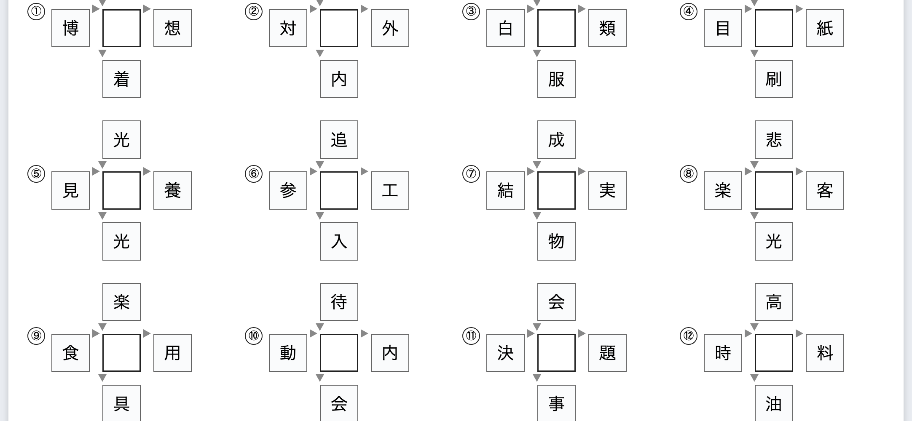

# Centre-kanji puzzles (和同開珎), plan

Draft for review. Nothing below is implemented; every number came from a probe
run against the data the app already ships, and the sheet in the figure was
built from it.

## 1. What it is

A kanji goes in the middle. The four around it each make a two-character word
with it, two reading in and two reading out. The pupil works out the middle one
and writes it in the empty box.

Twelve of these fit a page comfortably, sixteen at a squeeze. The figure is real
output: ① is 愛 (自愛 博愛 愛着 愛想), ⑦ is 果 (成果 結果 果物 果実), ⑫ is 給
(高給 時給 給油 給料).

It is the one format on the shortlist that children ask for, and it drills
something the other sheets do not: that a kanji is a piece of many words, not a
single word's spelling.

## 2. Where the words come from

The corpus word lists already shipped, pooled across every grade: **5253
two-character compounds**, about 26 KB as a bare list. Indexed both ways, by the
character that ends a compound and the one that starts it, a candidate centre
needs two of each.

No new source. The build step gains one output, a compound index with the
frequency rank the word lists are already sorted by, so a puzzle reaches for
時給 before 月給.

## 3. What it covers

Measured over the kanji taught in each year, taking the largest puzzle that has
only one possible answer:

| | kanji taught | get a puzzle | with 4 words | with 3 |
|---|---|---|---|---|
| Grade 1 | 80 | **57** | 47 | 10 |
| Grade 2 | 160 | **121** | 99 | 21 |
| Grade 3 | 200 | **137** | 96 | 40 |
| Grade 4 | 202 | **114** | 77 | 36 |
| Grade 5 | 193 | **126** | 89 | 36 |
| Grade 6 | 191 | **93** | 53 | 39 |

Two things made this work, both of which came out of the conversation rather
than the first draft:

- **Three words are enough when four are not.** Dropping to three lifts grade 3
  from 96 to 137 and grade 6 from 53 to 93. Going to two does not help: with
  only two blanks, another kanji almost always fits as well, and exactly one
  kanji per grade survived the uniqueness test at that size. Three is the floor.
- **Partners are not restricted to the level.** They carry furigana instead
  (5.3). Restricting them to kanji already taught was what made the first
  measurement so bleak: grade 1 went from 11 usable kanji to 57.

A week's ten kanji will still not all yield puzzles, so a sheet mixes in kanji
from earlier years. That suits the format, which is revision as much as testing.

## 4. The answer has to be the only answer

A puzzle whose blanks another kanji also fills is not a puzzle. Every candidate
is checked against every jōyō kanji: if any of them completes all the words
shown, that puzzle is dropped or given another word until it is unique.

The dictionary is the judge, with **proper nouns excluded**. Left in, they make
nonsense rivals out of surnames and place names, exactly as they made 新出 read
にいで in the choice sheets. That is a trap this project has now been caught by
twice, which is why it is written down here.

## 5. The sheet

### 5.1 It is the first page that is not vertical writing

Everything the app prints today is a column of vertical text. A puzzle is a
cross, so it needs a grid: a row of puzzle blocks across the page, each a 3x3
grid of cells with the middle one open, and the heading running horizontally
along the top.

That is the real cost of this feature, and it is contained: the page frame, the
heading, the answer sheet, the saved set, the language files and the exporters'
plumbing all stay. What is new is one page renderer in `htmlExport.js` and one
in `docxExport.js`, where a cross becomes a nested table, which is how the answer
boxes are already built.

The figure above is that renderer, prototyped, so the layout is known to work
before any of it is written.

### 5.2 The material step is the lesson picker, nothing more

A puzzle is generated from a kanji, so this sheet needs no words pasted, no file
read, no sentences. Pick the kanji and the sheet exists. The picker shows which
of the chosen kanji can centre a puzzle and offers to fill the rest of the page
from earlier years.

### 5.3 Partners above the level get furigana

A partner the class has not met is readable with its reading over it, which is
what a textbook does. The reading has to be the one the partner takes *in that
compound*, and the app can work it out: the compound's reading is in the word
list, and the same splitter the choice sheets use divides it over the two
characters. **97% of the 5253 compounds split** (7397 of 7599 counting
duplicates). The rest are 熟字訓 (今日, 大人, 下手) and are simply not used as
puzzle words, which they should not be anyway.

### 5.4 What the teacher controls

- Puzzles per page, and which kanji are in them.
- Whether partners above the level are allowed at all, or only furigana'd ones.
- Swap any partner for another candidate, or regenerate one puzzle, the same
  editing the choice sheets have.
- Font, sizes, heading, corner picture: unchanged.

### 5.5 Answer sheet

The centre filled in red, like the other sheets.

## 6. Quality rules found while prototyping

- **The four partners must be distinct.** 栄 first came out with 光 both above
  and below (光栄 and 栄光), which reads as a mistake.
- **Prefer common compounds.** The word lists are frequency-ordered, so keep the
  rank when pooling them; without it 羽 draws 合羽 and 羽目 before 羽根.
- **Drop compounds whose reading does not split**, both because they cannot be
  furigana'd and because 熟字訓 make poor puzzle words.

## 7. Phases

1. `tools/build-compounds.mjs`: pool the two-character compounds with their
   readings and frequency rank into one index.
2. `src/puzzle.js`: pure. Build a puzzle for a kanji, largest first, partners
   ranked by commonness, rejecting any that another kanji also completes.
3. The sheet in the model: a page of puzzles rather than columns.
4. The grid renderer in `htmlExport.js`, and the puzzle editor.
5. The `.docx` renderer.
6. Furigana on above-level partners.
7. The answer sheet, the README, the language files.

Phases 1 to 4 give a printable sheet; 5 and 6 complete it.

## 8. Open

- Grade 6 is the weakest at 93 of 191, because its kanji make fewer everyday
  compounds. Worth checking whether a larger compound list would lift it, or
  whether the format simply suits the middle years best.
- Whether to offer the mirror of this puzzle, where the centre is given and one
  of the outer kanji is blank. Cheaper than it sounds, same data.
